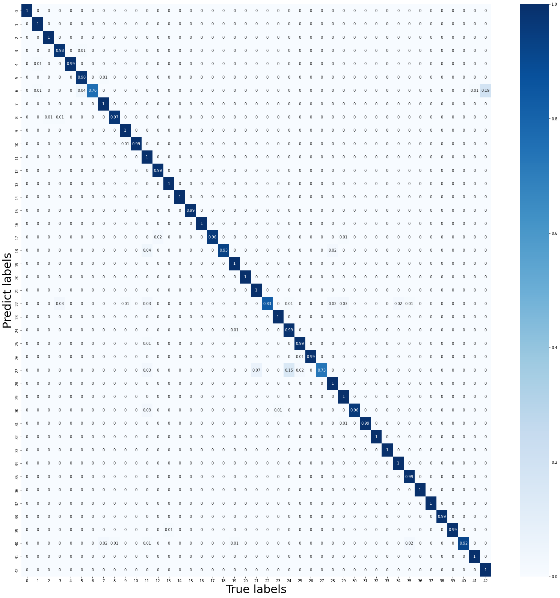

# This is an implementation of MobileNet by C++

## Why I make this?
Before implementing on FPGA or ASIC, we should build the model by software. And in order to evaluate the performance of the computation on Cortex-A9 in 666.6MHz, this is a necessary work to be done.  

# Accuracy (Top1)
|Model name|Accuracy|
|:-|:-|
|LeNet-5| 92.4465%|
|FCNN	|85.9065%|
|VGG-16	|87.6621%|
|VGG-19	|96.6904%|
|Xception	|93.5629%|
|MobileNet	|98.3927%|
|MobileNet(Quantized)	|94.7901%(should be higher)|

Here is the float32 MobileNet Confusion Matrix:  

  

# Run time
|Platform|Frequency|Data type|Run time|Power/W|
|-|-|-|-|-|
|CPU|3.98 GHz|INT8-TFLite|3.5432 s|30.83|
|CPU|3.98 GHz|INT8-Original|1885.8606 s|30.83|
|CPU|3.98 GHz|float32|2.9533 s|30.83|
|GPU|1.56 GHz|INT8|99.7325 ms|47.70|
|GPU|1.56 GHz|float32|42.8847 ms|47.70|
|PS-Cortex_A9|666.67 MHz|float32|82.6402 s|1.54|
|Accelerator|50.00 MHz|INT8|54.1067 ms|2.29|
  
# Some notice
|Platform|pre-define|
|:-|:-|
|Windows|`__WINDOWS__`|
|Cortex-A9|`__ARM__`|  
|Accelerate| `__DMA__`|

If you use Cortex-A9 platform, do not forget to adjust the heap size to `0x1fffffff` in file `lscript.ld` to prevent the overflow.

If you want to know how I train the MobileNet, please go to this link:    
[94.79% Accuracy by Q_MobileNet_v1](https://www.kaggle.com/mzc6838/94-79-accuracy-by-q-mobilenet-v1)  

# reference

> Main structure of the MobileNet model is refered from the article:  
> [MobileNets: Efficient Convolutional Neural Networks for Mobile Vision Applications](https://arxiv.org/abs/1704.04861)  

> The dataset used here is from Kaggle, the link of the dataset is:  
> [GTSRB - German Traffic Sign Recognition Benchmark](https://www.kaggle.com/meowmeowmeowmeowmeow/gtsrb-german-traffic-sign)  

